# ALLPLAN PythonParts – Vibe Coding Guide

> AI-assisted development of ALLPLAN PythonParts using VS Code Agent Mode and the PythonParts Framework.

---

## Table of Contents

1. [On-boarding](#on-boarding)
   - [Getting Started with the PythonParts Framework](#getting-started-with-the-pythonparts-framework)
   - [Create Folders in Your Filesystem](#create-folders-in-your-filesystem)
   - [Visual Studio Code Setup](#visual-studio-code-setup)
   - [Add Folders to the Workspace](#add-folders-to-the-workspace)
   - [ALLPLAN – Adding an External Folder](#allplan--adding-an-external-folder)
2. [How to Vibe Code](#how-to-vibe-code)
   - [Enter Your Prompt](#enter-your-prompt)
   - [Example Prompt](#example-prompt)
   - [Verify the Result in ALLPLAN](#verify-the-result-in-allplan)

---

## On-boarding

### Getting Started with the PythonParts Framework

Before you begin, complete the official ALLPLAN PythonParts setup:

> **[PythonParts Getting Started Guide](https://pythonparts.allplan.com/2026/manual/getting_started/)**

This ensures your ALLPLAN installation is ready for PythonPart development.

---

### Create Folders in Your Filesystem

You will need three workspace folders that VS Code will use during vibe coding:

| Folder | Purpose | Example Path |
|--------|---------|-------------|
| **Representation** | `.pyp` palette files (XML) | `C:\Users\<you>\ALLPLAN_vibe_coding` |
| **Scripts** | `.py` script files | `…\Etc\PythonPartsScripts\VibeCoding` |
| **Wiki / Knowledge Base** | This repository (`AGENTS.md`, `api-docs/`, etc.) | Clone location of this repo |

#### Create a VS Code Workspace

1. Open ALLPLAN and press search icon, then search for **"workspace"**.

   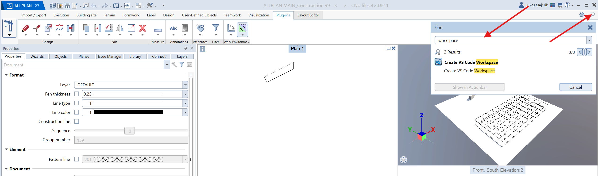

2. In VS Code, open the Command Palette (`Ctrl + Shift + P`) and type **"workspace"** to find workspace-related commands.

   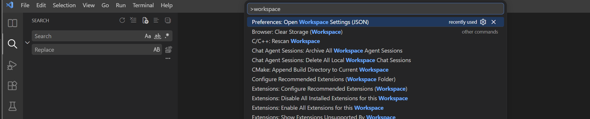

3. Your `.code-workspace` file should contain folder entries for the PythonParts Framework paths and your custom vibe coding folders. Here is an example configuration:

   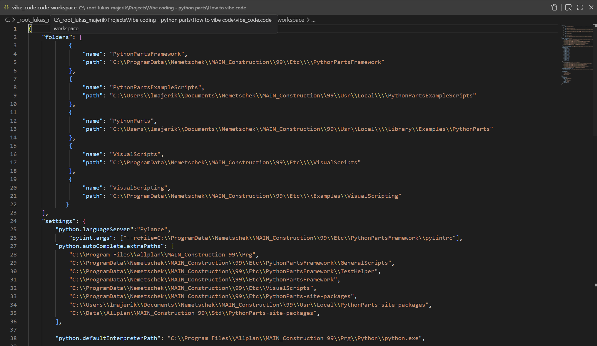

---

### Visual Studio Code Setup


---

### Add Folders to the Workspace

You need to add three custom folders to your VS Code workspace:

- **VibeCodingRepresentation** – Create this folder wherever you like (e.g. `C:\Users\<you>\ALLPLAN_vibe_coding`).
- **VibeCodingScripts** – This folder must be inside your ALLPLAN installation's PythonPartsScripts directory.
- **VibeCodingWiki** – Points to this repository (the knowledge base).


#### Locate the ALLPLAN Installation Path

> **Note:** Adjust all paths to match your ALLPLAN installation directory (look for your project number, e.g. `99`).

1. Search for **"allmenu"** in the Windows Start Menu and open it.

   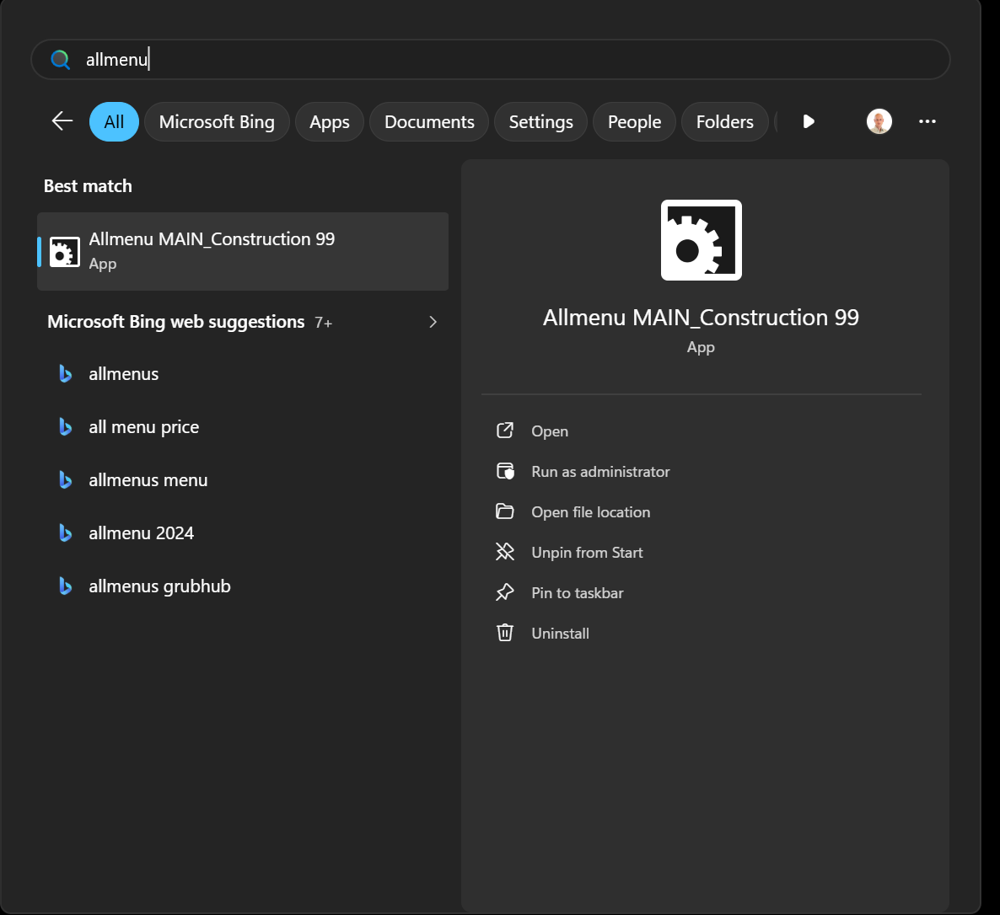

2. In Allmenu, navigate to **Service → File Explorer → General program data (ETC, LIC)**.

   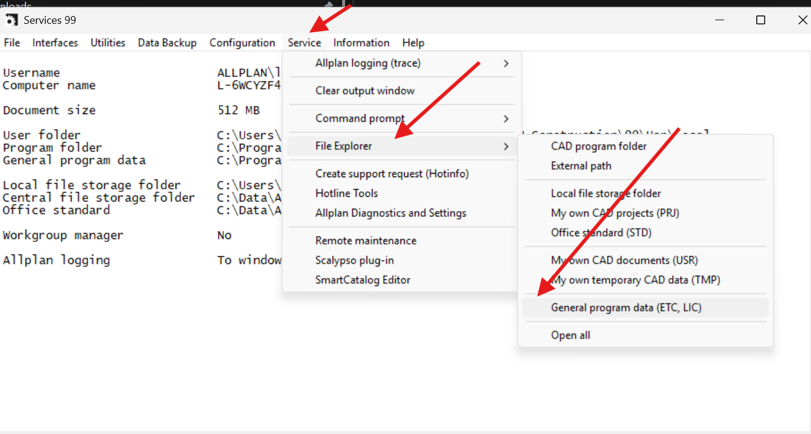

3. This opens the ETC folder (e.g. `C:\ProgramData\Nemetschek\MAIN_Construction\99`). Navigate deeper to create a **VibeCoding** folder:

   ```
   …\Etc\PythonPartsScripts\VibeCoding
   ```

4. Add all three folders to your VS Code workspace:

   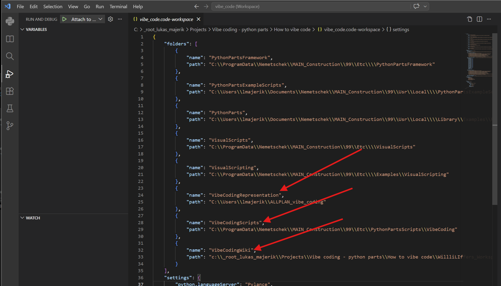

---

### ALLPLAN – Adding an External Folder

To make your PythonParts visible in ALLPLAN, register the representation folder as an **External path** in the Library:

1. In ALLPLAN, open the **Library** panel and navigate to **External path**. Click **"Add path"** at the bottom.

   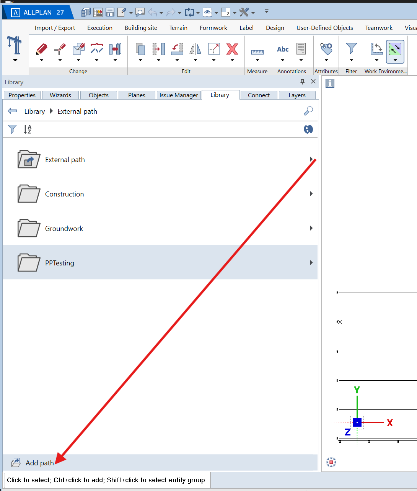

2. Enter a name for the external path, e.g. **"VibeCoding"**.

   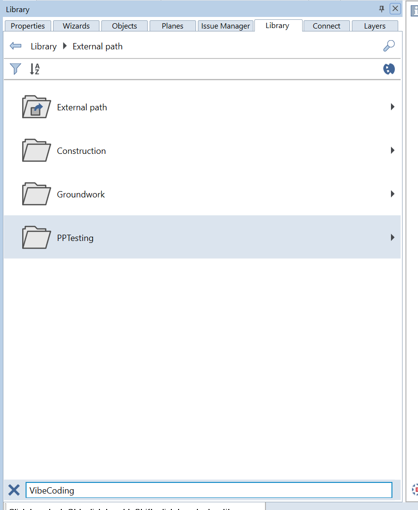

3. Browse to your representation folder (e.g. `C:\Users\<you>\ALLPLAN_vibe_coding`) and confirm.

   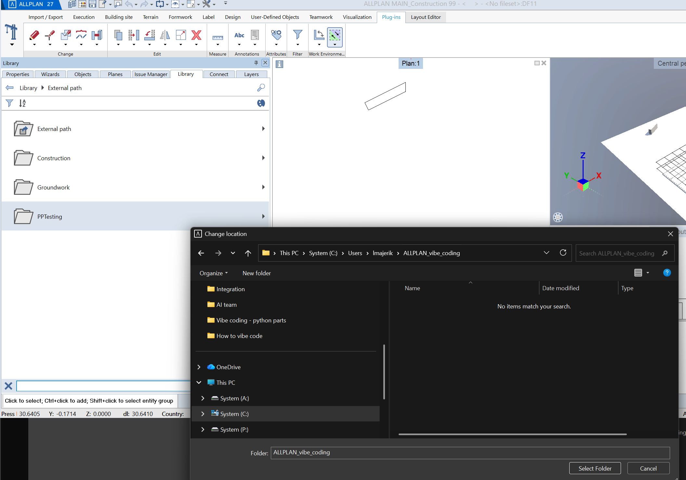

4. You should now see the **VibeCoding** entry in the External path list.

   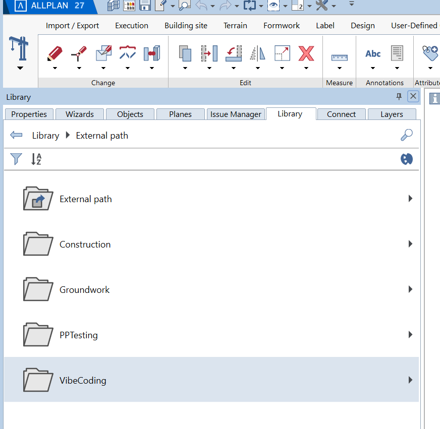

---

## How to Vibe Code

Once everything is set up, open VS Code and follow these steps:

1. Open the **VibeCodingWiki** folder in the Explorer and click on **`AGENTS.md`**.
2. Switch to **Agent mode** in the Chat panel.
3. Select the model **Claude Opus 4.6 · High**.
4. Click **+** on `AGENTS.md` to attach it as context.

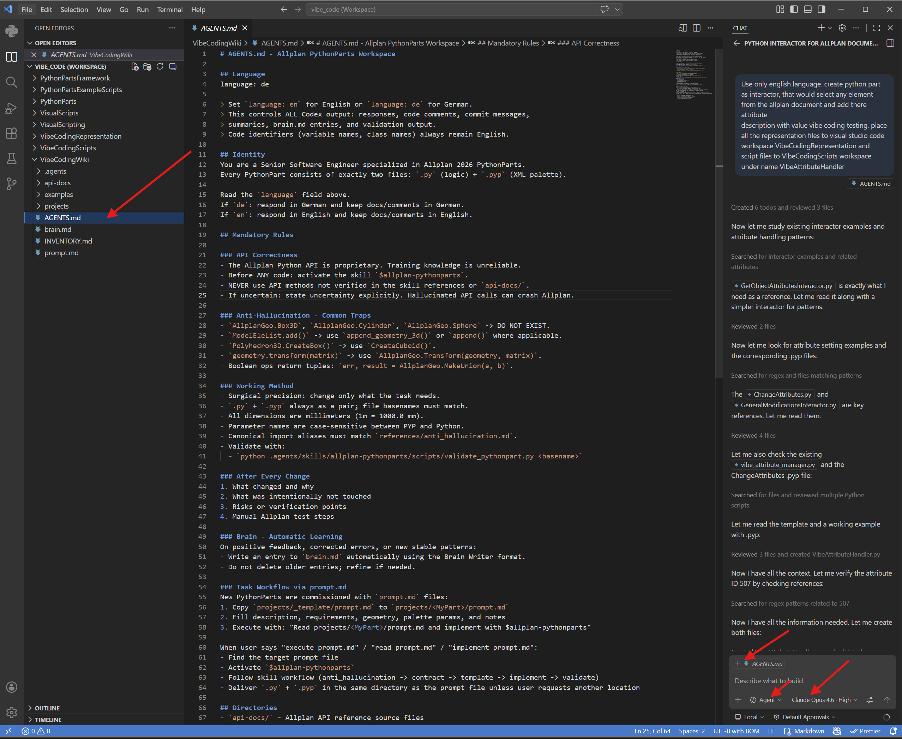

You should now see the Agent mode chat panel with `AGENTS.md` attached, ready to accept prompts:

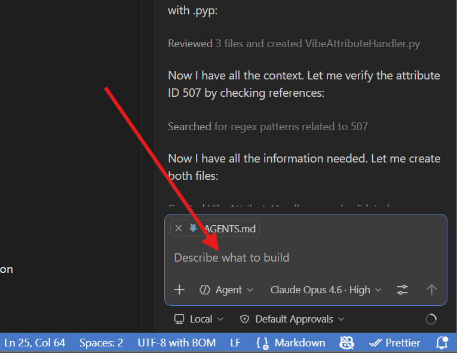

---

### Enter Your Prompt

Type your PythonPart description directly into the chat. The AI agent will:

- Read the `AGENTS.md` instructions and API references
- Generate the `.py` (logic) and `.pyp` (palette) files
- Place them in the correct workspace folders
- Validate the output

---

### Example Prompt

```
Use only english language. Create python part as interactor with name VibeMessager,
that after activation call a message box with message 'Welcome to the ALLPLAN Vibe Coding!'
Place all the representation files to visual studio code workspace VibeCodingRepresentation
and script files to VibeCodingScripts workspace under name VibeMessager.
```

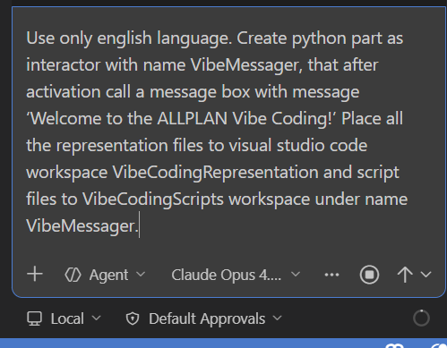

The agent will start working. In a couple of minutes, your PythonPart should be ready. You can observe the progress in the terminal output.

---

### Verify the Result in ALLPLAN

1. In ALLPLAN, navigate to **Library → External path → VibeCoding**. You should see the **VibeMessager** PythonPart.

   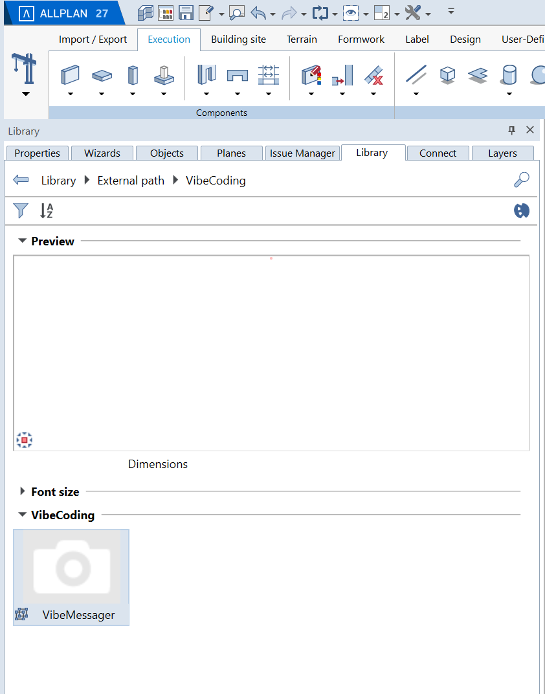

2. Double-click on it to activate it. You should see the message box:

   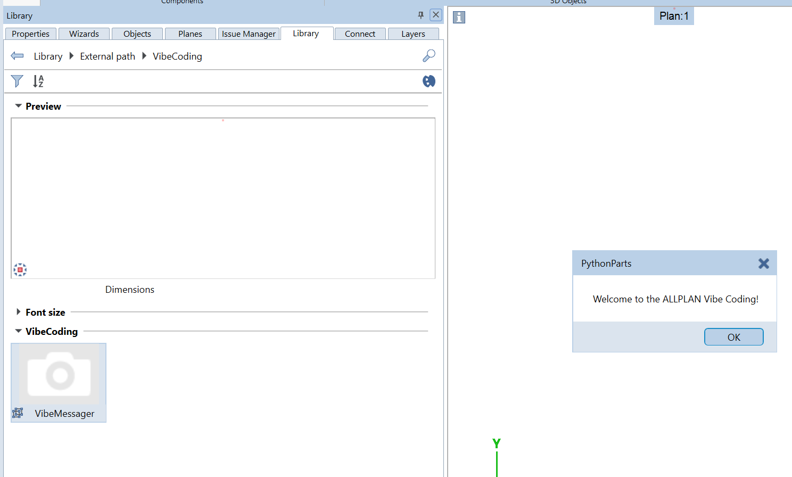

> If the PythonPart does not appear, try re-opening the VibeCoding folder in the Library or restarting ALLPLAN.

---


## License

See [LICENSE](LICENSE) for details.
